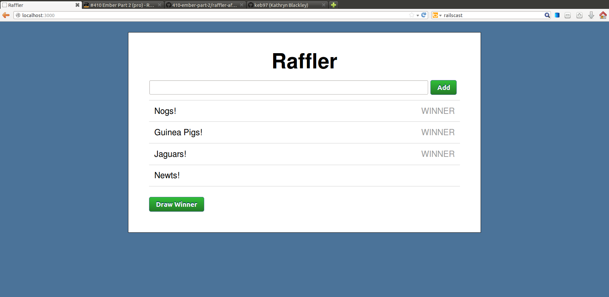

This is an app built based on Railscasts #408 and #410 about ember.
It is a Ruby on Rails app where all of the client side javascript is ember.js from the ember-rails gem. Rails interacts with the server (in this case the default, SQLite3) to save the raffle entries from ember.

This is an app where you can enter people into a raffle and then click a button to randomly assign the winner. You can select multiple winners, and the most recent winner will have their "winner" appear in bold red.

